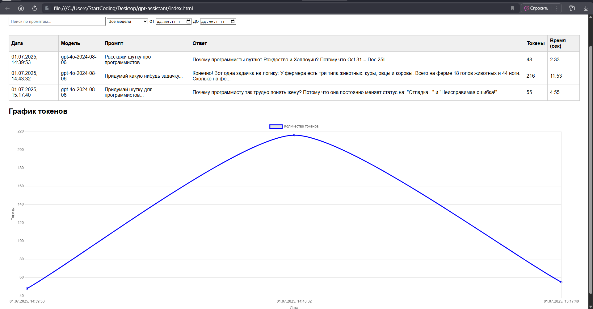
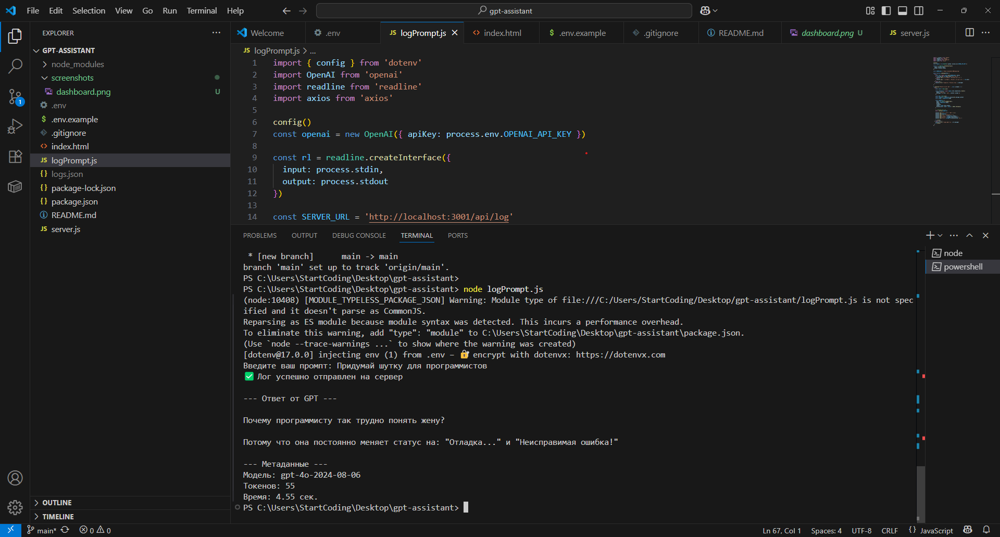

# GPT Monitoring & AI Prompt Assistant

[](LICENSE)
[]()
[](https://github.com/tajmaker)

> Масштабируемая open-source платформа для мониторинга, аналитики и улучшения взаимодействия с AI-моделями (GPT). Логирование промптов, визуализация, API-first архитектура, SDK для интеграций.

---

## 🚀 Возможности

- Логирование всех промптов и ответов GPT через SDK
- Web-панель с графиками токенов, поиском и фильтрами
- Сервер на Fastify + PostgreSQL (cloud-ready)
- Масштабируемая архитектура для SaaS и командной работы
- Готов к интеграции с любым языком и любой командой

---

## 🛠️ Быстрый старт

```bash
# Клонировать репозиторий
git clone https://github.com/tajmaker/gpt-assistant.git

# Установить зависимости
npm install

Создать базу и таблицу в PostgreSQL:
CREATE DATABASE gpt_assistant;
\c gpt_assistant
CREATE TABLE logs (
  id SERIAL PRIMARY KEY,
  date TIMESTAMP,
  model TEXT,
  prompt TEXT,
  response TEXT,
  tokens INT,
  duration_sec FLOAT
);

Создать .env (см. .env.example):
OPENAI_API_KEY=sk-...ваш_ключ

Запустить сервер:
node server.js

Запустить локальный сервер для панели:
npx serve .
# или любой live-server

Панель доступна по адресу: http://localhost:3000/

📦 Структура проекта
server.js — Backend/API (Fastify + PostgreSQL)

logPrompt.js — SDK для логирования промптов (Node.js)

index.html — Веб-панель аналитики

.env.example — Пример переменных окружения

🎯 Roadmap
 Авторизация (multi-user, OAuth)

 SaaS: команды и workspaces

 Интеграция AI-ассистента для автоподсказок промптов

 Дополнительные графики, отчёты, экспорт

 Публичный облачный демо-доступ

 Интеграции: Python, REST, Webhooks

🖼️ Скриншоты
### Панель мониторинга


### Пример работы SDK



📃 License
MIT

Work in Progress! Любой фидбэк, PR и идеи — приветствуются.
